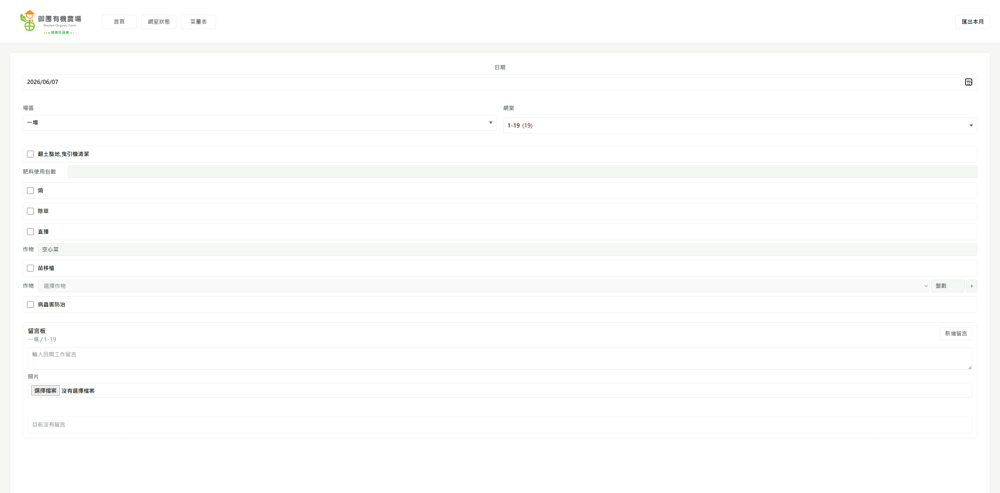

# Sheden Organic 營運管理系統

這是一套為有機農場內部營運建立的全端管理系統，將原本分散在 Excel、人工表格與現場紀錄中的流程，整合成可登入、可保存、可部署、可長期維護的 Web App。

系統涵蓋全聯與其他通路進銷存、出貨單、採收規劃、田間工作紀錄、網室狀態、每日菜量、採菜單、留言與照片、帳號權限管理。Excel 在此專案中只作為匯入、匯出與格式參考，不作為網頁 runtime 資料來源。

## 作品集重點

- 將農場日常作業流程轉成資料庫驅動的 Web App。
- 使用原生 HTML / CSS / JavaScript 建立大型表格、行動裝置輸入、PWA 更新與多頁工作流。
- 使用 Python `http.server` 自製 API handler，支援登入、權限、資料保存、Excel 匯入匯出與檔案上傳。
- 本機開發使用 SQLite，正式部署可切換 Cloud SQL for PostgreSQL。
- 本機上傳使用 `uploads/`，正式環境使用 Google Cloud Storage。
- 部署到 Google Cloud Run，並透過 Secret Manager 管理正式環境密鑰。
- 保留資料庫 migration、部署文件、runtime config check、smoke test 與備份腳本。

## 主要功能

- 帳號登入與角色權限：管理員、內場、外場三種角色，依角色顯示與限制 API 操作。
- 全聯每日進銷存：門市、品項、銷售、到貨、庫存、調整量與同步版本管理。
- 出貨單：選擇出貨門市、分批出貨、匯出出貨單與上傳格式。
- 採收規劃：可編輯採收表、採收留言板、大標列印、採收順序與轉換設定。
- 田間工作紀錄：依日期、場區、網室記錄作業項目、作物、穴盤、肥料使用與稽核資料。
- 蘇力菌紀錄：獨立紀錄與月報匯出。
- 網室狀態：種植、採收、狀態、作物與備註資料，並可與田間工作紀錄同步。
- 每日菜量與採菜單：整合網室採收量與手動菜量，支援匯出 Excel。
- 其他通路表格：永豐餘、City、一般通路、裸菜等通路資料輸入與保存。
- PWA：支援安裝、service worker 更新檢查與版本化前端資產。
- 中越雙語介面：田間與網室工作流程支援繁體中文與越南文。

## 演示畫面

從田間工作紀錄保存開始，存取每日田間的工作紀錄



## 技術架構

```text
Browser / PWA
  |
  |  HTML, CSS, JavaScript
  v
docs/
  index.html        App shell
  app.js            Frontend state, rendering, API calls, PWA update flow
  styles.css        Responsive layout and mobile/table UI
  sw.js             Service worker
  manifest.json     PWA metadata
  |
  |  fetch /api/*
  v
scripts/server.py
  Auth, role checks, API routing, exports, imports, static asset serving
  |
  |  database functions
  v
scripts/database.py
  SQLite / PostgreSQL schema guards and data access
  |
  +--> scripts/storage.py
       Local uploads or Google Cloud Storage
```

## 資料與部署策略

本機開發預設使用 SQLite：

```text
DATABASE_BACKEND=sqlite
APP_DB_PATH=data/app.db
FILE_STORAGE_BACKEND=local
APP_UPLOADS_DIR=uploads
```

正式部署可切換為 Cloud Run + Cloud SQL + Cloud Storage：

```text
DATABASE_BACKEND=postgres
DATABASE_URL=<Secret Manager>
FILE_STORAGE_BACKEND=gcs
GCS_BUCKET=<Cloud Storage bucket>
INITIAL_ROOT_PASSWORD=<Secret Manager>
```

此專案刻意將程式碼、資料、上傳檔、備份與暫存檔分離：

- `data/`：本機 SQLite runtime data，不進 Git。
- `uploads/`：本機上傳檔，不進 Git。
- `backups/`：備份輸出，不進 Git。
- `.env`：本機環境密鑰，不進 Git。
- Excel / CSV / PPTX：匯入匯出或一次性參考，不進 Git。

## 專案結構

```text
.
├── docs/                         Frontend 靜態檔案與部署文件
│   ├── index.html
│   ├── app.js
│   ├── styles.css
│   ├── sw.js
│   ├── manifest.json
│   ├── architecture/
│   └── deployment/
├── scripts/                      Backend、資料庫、匯入匯出與檢查腳本
│   ├── server.py
│   ├── database.py
│   ├── storage.py
│   ├── smoke_test.py
│   ├── check_runtime_config.py
│   └── migrate_sqlite_to_postgres.py
├── migrations/postgres/          PostgreSQL migration SQL
├── infra/                        GCP / Cloud Storage 設定
├── data/.gitkeep                 本機資料庫 placeholder
├── uploads/.gitkeep              本機上傳目錄 placeholder
├── backups/.gitkeep              備份目錄 placeholder
├── Dockerfile
├── docker-compose.yml
├── cloudbuild.yaml
└── requirements.txt
```

## 本機啟動

```bash
python3 -m venv .venv
source .venv/bin/activate
pip install -r requirements.txt
python scripts/server.py
```

預設網址：

```text
http://127.0.0.1:4174/
```

也可以使用 Docker Compose：

```bash
docker compose up --build
```

## 驗證與維護

```bash
python3 -m py_compile scripts/*.py
python3 scripts/check_runtime_config.py
python3 scripts/smoke_test.py
python3 scripts/backup_runtime_data.py
```

部署流程目前透過 Cloud Build 手動觸發：

```bash
gcloud builds submit --config cloudbuild.yaml
```

## 安全與資料保護

實作上的資料保護包含：

- API 層角色權限檢查。
- 密碼 PBKDF2 hash。
- session cookie。
- Cloud Run 正式環境使用 Secret Manager 注入敏感設定。
- Cloud Storage 作為正式上傳檔持久化儲存。
- PostgreSQL schema 初始化鎖，避免多 instance 同時 DDL。
- 備份與 smoke test 腳本，降低部署與資料遷移風險。

## 設計原則

- Excel 只作為匯入、匯出與一次性格式參考，不作為 runtime source。
- 使用者在網頁輸入的資料保存到資料庫。
- 前端表格格式、欄位、品項與預設資料由程式與資料庫管理。
- 正式資料不寫入 Cloud Run container filesystem。
- 新功能需要考慮長期維護、部署、資料安全、效能與備份還原。
